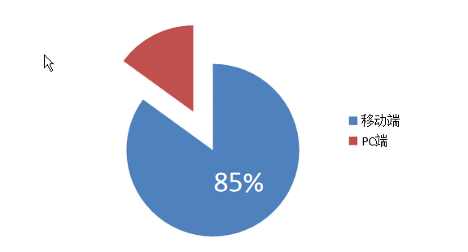
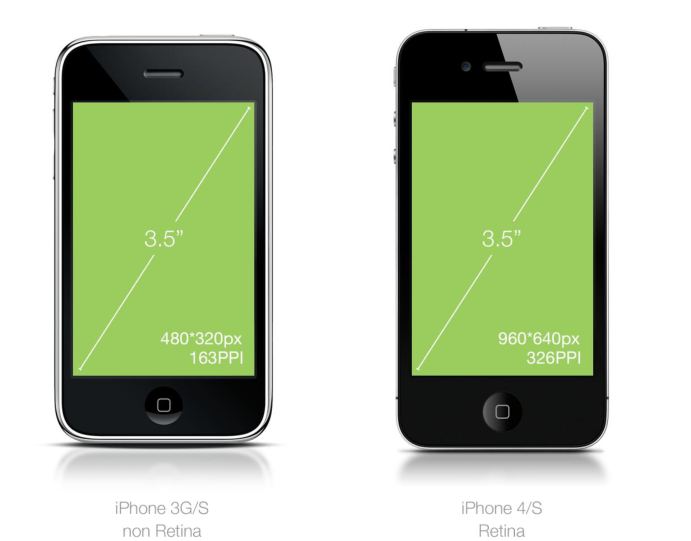
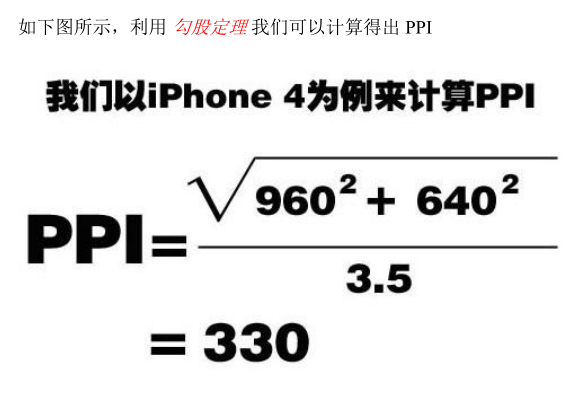
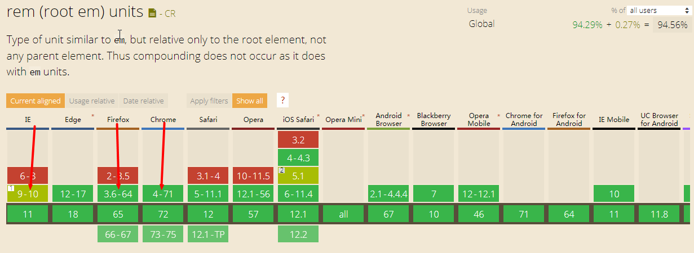
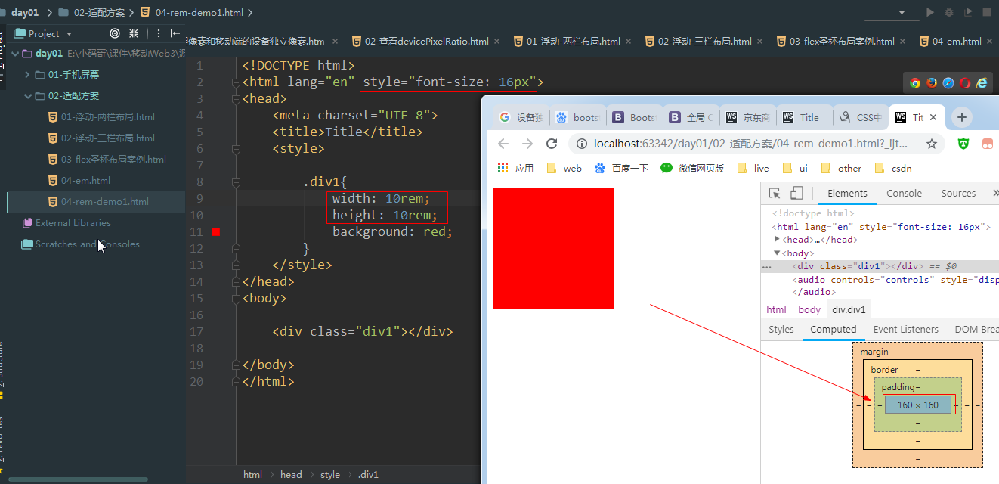

# Day01 移动web

# 一.移动web介绍(了解)

### PC端开发 VS 移动web开发

1）PC端开发

使用的技术：html  css  js 

侧重点：pc端的兼容和适配(浏览器的兼容性)，pc端的事件（鼠标）


2）移动web

使用的技术：html  css  js 

侧重点：手机端适配（浏览器都是webkit内核，要兼用的是手机的分辨率），移动端事件（触摸）,缺少的是hover事件

### 为什么学习移动web

主要是需求决定。用手机端 消费 的人越来越多

例如：

京东双十一销售额(  2015  )


京东双十一销售额 ( 2016 )




# 二.手机屏幕（私下了解就可以）

移动设备与 PC 设备最大的差异在于屏幕，这主要体现在**屏幕尺寸**和**屏幕分辨率**两个方面。


### 1.屏幕尺寸

通常我们所指的**屏幕尺寸**，实际上指的是屏幕对角线的长度（一般用英寸来度量）如下图所示:( 3.5英寸 ,  4.7英寸,  5.5英寸 )

		 iPhone 3 / 4                  			   iPhone 6       			     iPhone 6  plus


### 2.分辨率

而**分辨率**则一般用**像素来度量 px**，表示**屏幕水平和垂直方向的像素个数**，

例如 ：1920*1080 px 分辨率 

指的是屏幕垂直方向和水平方向分别有 1920 和 1080 个像素点而构成。

如下图所示


### 3.长度单位

在 Web 开发中可以使用 px（像素）、em、rem、pt（点）、in（英寸）、cm（厘米）做为长度单位，我们最常用 px（像素）做为长度单位。

pt(点) ios开发是以点做为单位的，是抽象的单位，是设备的独立像素。

我们可以将上述的几种长度单位划分成**相对长度单位**和**绝对长度单位(in、cm)**。

> iPhone 3G/S 的分辨率是480 * 320 px
>
> iPhone 4/S  的分辨率是960 * 640 px

如上图所示，iPhone3G/S 和 iPhone4/S 的**屏幕尺寸**都为 **3.5 英寸（in）**但是**屏幕分辨率却分别为 480  *  320px、960   *  480px**，由此我们可以得出**英寸是一个绝对长度单位，而像素是一个相对长度单位（像素并没有固定的长度）**。




### 4.像素密度( PPI )

> 像素密度PPI ：就是屏幕每英寸的像素数量

**DPI**（Dots Per Inch）是印刷行业中用来表示打印机每英寸可以喷的墨汁点数，计算机显示设备从打印机中借鉴了 DPI 的概念。


由于**计算机显示设备**中的最小单位不是墨汁点而是像素，所以用 **PPI**（Pixels Per Inch）值来表示**屏幕每英寸的像素数量**，我们将 **PPI、DPI 都称为像素密度**，但 **PPI** 应用更广泛，

1）计算像素密度

例如下图的像素密度（PPI = 10）

> 下图屏幕的宽为1英寸，1英尺的像素数量为10 px


例如下图的像素密度（PPI = 20）

> 下图屏幕的宽为1英寸，1英尺的像素数量为20 px


2）计算iphone 4手机的像素密度（PPI = 330）


iphone 4手机 是 3.5 英寸。先求出3.5英寸中的像素个数，在除与3.5就是每英寸的像素个数




**PPI 值的越大**说明单位尺寸里所能容纳的**像素数量就越多**，所能**展现画面的品质也就越精细**，反之就越粗糙。

**Retina** 即**视网膜屏幕**，苹果注册的命名方式，意指具有较高 PPI（大于 320）的屏幕。


> 思考：在屏幕尺寸（英寸）固定时，PPI 和像素大小的关系？
>
> 屏幕尺寸固定时，当 PPI 越大，像素的实际大小就会越小，当 PPI越小，像素实际大小就越大。


### 5.像素

#### 1）物理像素(  也称: 设备像素 )

**设备像素（物理像素）**，顾名思义，显示屏是由一个个**物理像素**点组成的，通过控制每个像素点的颜色，使屏幕显示出不同的图像，屏幕从工厂出来那天起，它上面的**物理像素点**就固定不变了。

> 1）物理像素大小不是固定的，它与PPI 是有关系。例如：PPI越大，物理像素越小。
>
> 2）物理像素只能获取不能修改

下图屏幕的宽为1英寸，1英尺的像素数量为10 px ,  物理像素就是10 px


例如下图:

iPhone 3G/S 的分辨率是480 * 320 px，物理像素是480 * 320 px

iPhone 4/S  的分辨率是960 * 640 px，物理像素是960  * 640  px


使用js代码 获取 pc端的物理像素 和 移动端的设备像素

```
// 获取pc端屏幕的物理像素、获取移动端屏幕的设备独立像素
window.screen.width;
window.screen.height;
```


#### 2）css像素px( 主要用在web )

CSS像素是一个抽像的单位，**主要使用在浏览器上**，用来精确度量Web页面上的内容。一般情况之下，CSS像素称为与设备无关的像素(device-independent pixel)，简称DIPs。

**1.PC 端的css像素默认和物理像素保持一致的（1 个单位的 CSS 像素等于 1 个单位的物理像素）**

**2.iPhone3G的css像素默认和物理像素保持一致（1 个单位的 CSS 像素等于1 个单位的物理像素）**

**3.iPhone4/5/6的css像素默认和物理像素不一致（1 个单位的 CSS 像素等于2 个单位的物理像素）**

**4.iPhonex/6/7/8plus的css像素默认和物理像素不一致（1 个单位的 CSS 像素等于3 个单位的物理像素）**


### 6.设备独立像素(pt,dp,dip)

iPhone 3G/S 的分辨率是480 * 320 px，物理像素是480 * 320 px，设备独立像素：480 * 320 pt

iPhone 4/S  的分辨率是960 * 640 px，物理像素是960  * 640  px,  设备独立像素：480 * 320 pt


随着技术发展，设备不断更新，出现了不同 **PPI 的屏幕**共存的状态（如iPhone3G/S 为 163PPI，iPhone4/S 为 326PPI），**像素不再是统一的度量单位**，这会造成同样尺寸的图像在不同 PPI 设备上的显示大小不一样。

#### 1.存在的适配问题


如下图，假设你设计了一个 163px*163px 的蓝色方块。

在 PPI 为 163 的屏幕上（代表1英寸能显示163个像素），那这个方块看起来正好就是 1*1 寸大小，

在 PPI 为 326 的屏幕上（代表1英寸能显示326个像素），这个方块看起来就只有 0.5*0.5 寸大小了。


#### 2.解决移动端适配(新单位)

做为用户是不会关心这些细节的，他们只是希望在**不同 PPI 的设备上看到的图像内容差不多大小**，所以这时我们需要一个**新的单位**，这个新的单位能够

保证图像内容在不同的 PPI 设备看上去大小应该差不多，这就是**设备独立像素**，在IOS 设备上叫 **PT**(Point)，Android 设备上叫 **DIP**(Device independent Pixel)或 **DP**。


举例说明: 

 iPhone 3G（PPI 为 163） 1pt = 1px，

 iPhone 4（PPI 为 326）     1pt = 2px

 iPhone 6plus（PPI 为 >326）     1pt = 3px


#### 4.根据手机设备使用2/3倍图

我们也不难发现，如果想要 iPhone 3G/S 和 iPhone 4/S 图像内容显示一致，可以把 iPhone 4/S 的尺寸放大一倍（它们是一个 2 倍( @2x )的关系），即在iPhone3G/S 的上尺寸为 44px * 44px，在 iPhone4/S 上为 88px * 88px。


我们要想实现这样的结果可以设置 44pt * 44pt，这时在 iPhone3G/S 上代表 44px*44px，在 iPhone4/S
上代表 88 * 88px，最终用可以看到的图像差不多大小。


通过上面例子我们不难发现 pt 同 px 是有一个对应（比例-@1x  @2x  @3x）关系的，这个对应（比例）关系是操作系统确定并处理，目的是确保不同 **PPI 屏幕**所能显示的图像大小是一致的，通过 window.devicePixelRatio 可以获得该比例值( @1x  @2x  @3x  )。

>  window.devicePixelRatio  = px  /  pt
>
>  **设备像素比** = **物理像素** / **设备独立像素**
>
>  @2x           =  960 px  /  480 pt      (  这个以iPhone 4S  【 640 * 960 px -->  320 * 480 pt 】为例子 )


iPhone手机的设备像素比：


>  使用js代码 查看  iPhone 不同型号间 dp 和 px 的比例关系：window.devicePixelRatio


# 三.px、em、rem、%区别介绍（重点）

### 1.px

px像素（Pixel）。相对长度单位。像素px是相对于显示器屏幕分辨率而言的。p，它是一个固定大小的单元，用PX设置字体大小时，比较稳定和精确。它是固定大小的单位，单独用它来设计的网页，如果适应大屏幕（电脑），在小屏幕（手机）上就会很不友好，做不到自适应的效果。

**PX特点**

- IE无法调整那些使用px作为单位的字体大小；
- 国外的大部分网站能够调整的原因在于其使用了em或rem作为字体单位;
- Firefox能够调整px和em，rem，但是96%以上的中国网民使用IE浏览器(或内核)。

### 2.em

em是相对长度单位。相对于当前对象内文本的字体尺寸。如当前对行内文本的字体尺寸未被人为设置，则相对于浏览器的默认字体尺寸。

任意浏览器的默认字体高都是16px。所有未经调整的浏览器都符合: 1em=16px。

**em特点**

- em的值并不是固定的；

- em会继承父级元素的字体大小。

  

  **注意：**任意浏览器的默认字体高都是16px。所有未经调整的浏览器都符合: 1em=16px。那么12px=0.75em,10px=0.625em。为了简化font-size的换算，需要在css中的body选择器中声明Font-size=62.5%，这就使em值变为 16px*62.5%=10px, 这样12px=1.2em, 10px=1em, 也就是说只需要将你的原来的px数值除以10，然后换上em作为单位就行了。

  所以我们在写CSS的时候，需要注意两点：

  - body选择器中声明Font-size=62.5%；
  - 将你的原来的px数值除以10，然后换上em作为单位；
  - 重新计算那些被放大的字体的em数值。避免字体大小的重复声明。

### 3.rem (CSS3新增的一个相对单位)

rem 相对于根元素 <html> ，这样就意味着，我们只需要在根元素确定一个参考值。

这个单位与em有什么区别呢？区别在于使用rem为元素设定字体大小时，仍然是相对大小，但相对的只是HTML根元素。这个单位可谓集相对大小和绝对大小的优点于一身，通过它既可以做到只修改根元素就成比例地调整所有字体大小，又可以避免字体大小逐层复合的连锁反应。目前，除了IE8及更早版本外，所有浏览器均已支持rem。对于不支持它的浏览器，应对方法也很简单，就是多写一个绝对单位的声明。这些浏览器会忽略用rem设定的字体大小。

**rem特点**

- rem 相对单位，相对于根元素 `<html>` ;

- 相对大小和绝对大小的优点于一身;

- 修改根元素就成比例地调整所有字体大小;

- 避免字体大小逐层复合的连锁反应。

  

### 4.**%（百分比）**

%也很常见，它和em差不多一样，都是相对于父级元素。但%可以在很多属性中使用，比如：width、height、font-size等。而em是用来设置字体大小（font-size）的单位，width、height等属性是没有em单位的。

# 四.手机端的适配（重点）

### 1.添加ViewPort视口

由于移动端会自动缩放页面，所以我们需要加入meta标签，强迫页面不准缩放，进行一个1:1的显示，也就需要我们使用viewport。

浏览器默认把viewport设置为一个较宽的值 980px或1024px，至少保证PC网站在移动端上可以显示。

ViewPort 视口  ( 是虚拟的窗口，默认大小是 980 px )


移动设备屏幕普遍都是比较小的，但是大部分的网站又都是为 PC 设备来设计的，要想让移动设备也可以正常显示网页，移动设备需要设置视口来做适配。

**获取视口大小：**

> document.documentElement.clientWidth
>
> 例如：iPhone6/7/8  的视口大小是 375 pt ,   物理像素是750px

```
<meta name="viewport"
        content="width=device-width, user-scalable=no, initial-scale=1.0, maximum-scale=1.0, minimum-scale=1.0">
```

- `width`：控制 viewport 的大小，可以指定的一个值，如 600，或者特殊的值，如 device-width 为设备的宽度（单位为缩放为 100% 时的 CSS 的像素）。

  `height`：和 width 相对应，指定高度。

  `initial-scale`：初始缩放比例，也即是当页面第一次 load 的时候缩放比例。

  `minimum-scale`：允许用户缩放到的最大比例。

  `maximum-scale`：允许用户缩放到的最小比例。

  `user-scalable`：用户是否可以手动缩放。

### 2.布局适配方案

#### flex弹性布局（重点）

**容器属性:**

1.flex-direction:  规定了主轴的方向（父容器中的排列方向)

2.justify-content:  子item在主轴方向的对齐方式

3.align-Items:  子item在单行侧轴方向的对齐方式 align-content 多行侧轴居中的问题

4.flex-wrap : 设置换行


**item属性:**

flex-basis 列表项的宽度,书写了宽度，width就不生效了。以flex-basis为主

flex-shrink 列表项 收缩 ，超出父容器空间才生效

flex-grow 列表项的增长，将父容器的剩余空间 平分比例生长

flex 值可以为0 或者1   

  值为1 时是一个综合值： `flex-grow:1; flex-basis:0%; flex-shrink:1`

值为0时也是给综合值：`flex-grow:0; flex-basis:0%; flex-shrink:1`

flex兼容性：


flex布局圣杯布局案例：


```html
<!DOCTYPE html>
<html lang="en">
<head>
    <meta charset="UTF-8">
    <title>03-flex圣杯布局案例.html</title>
    <style>
        *{
            margin: 0;
            padding: 0;
        }
        header{
            height: 44px;
            width: 100%;
            background: skyblue;
            display: flex;/**指定弹性布局*/
            flex-direction: row;/**指定主轴*/
        }

        .left{
            height: 100%;
            background: red;
        }

        .center{
            flex:1;/**指定权重*/
            height: 100%;
            background: purple;
        }

        .right{
            height: 100%;
            background: red;
        }
    </style>
</head>
<body>


<header>
    <div class="left">left</div>
    <div class="center">center</div>
    <div class="right">right</div>
</header>
</body>
</html>
```

#### 4.rem布局-（重点）

案例：如果一个 div 有 18px 字体大小，给标签10em 将等同于 180px，即` 10em × 18px = 180px`


> 根据W3标准 ，em 单位是相对于使用em单位的元素的字体大小( 也是相对于字体大小，有可能是父亲的元素也有可能是自身的元素字体大小 )

```html
<!DOCTYPE html>
<html lang="en">
<head>
    <meta charset="UTF-8">
    <title>Title</title>
    <style>
        header{
            font-size: 18px;
        }
        .div1{

            width: 10em;
            height: 10em;
            background: red;
        }
    </style>
</head>
<body>

<header>
    <div class="div1"></div>
</header>

</body>
</html>
```


**3.什么是rem**

> rem 转成 px ：跟 html 字体大小 有关系

Root Element（REM）是CSS3中新定义的一种长度单位。和em单位相比在使用上具有明显的优势。

Rem转化为像素px大小取决于页根元素html的字体大小，即 html 元素的字体大小

> 使用rem单位时，像素值=是rem值乘以html元素的字体大小( `像素px=rem值 * fontSize大小`)

  

rem的兼容性：

 

 使用案例1：根元素html的字体大小 16px，给标签10rem 将等同于 160px，即 `10rem  x 16px = 160px`



使用案例2：根元素html的字体大小 100px，给标签1rem 将等同于 100px，即 `1rem  x  100px = 100px `


#### 5.vw  vh 布局（相对单位相对于屏幕宽度）

**1.css单位长度值**

| 单位    | 含义                                                 |
| ------- | ---------------------------------------------------- |
| **em**  | 相对于父元素（或自身元素）的字体大小                 |
| **rem** | 相对于根元素（html）字体大小                         |
| **vw**  | **相对于视窗的宽度：视窗宽度是100vw**                |
| **vh**  | **相对于视窗的高度：视窗高度是100vh**                |
| px      | 像素                                                 |
| %       | 相对于父元素。正常情况下是通过属性定义自身或其他元素 |

**2.vw vh 兼容性**

`vw`, `vh`这几个视区相关单位，在2012年9月23号这天的兼容性为：Chrome 20+, IE9+ 以及Safari 6支持！


**3.案例**

使用案例：假设给根元素html的字体大小设置为26.66666vw，转成px单位字体大小是 100px，给标签0.5rem 将等同于50px，即 `0.5rem  x  100px = 50px `

```html
<!DOCTYPE html>
<html lang="en">
<head>
    <meta name="viewport" content="width=device-width, initial-scale=1.0">
    <meta charset="UTF-8">
    <title>index</title>
    <style>

        *{margin: 0; padding: 0; list-style: none; border: none;}
        /*指定根字体大小，100px 都是以iphone6屏幕来进行计算的，很多时候，屏幕的内容会随着，屏幕的变大而变大，需要转换为vw值*/
        /*
        
        100px      ?vw												 100px*100vw
 	   ------ =  ------     --->   100px *100vw = ?vw*375px  -----> -----------  = ?vw
        375px      100vw												375px
        
        
        */
      
        html{ font-size: 100px; font-size:26.66667vw;}
        /*屏幕 尺寸超过640像素，限制根字体大小，到一定的范围*/
        @media (min-width: 640px) {
            html{
                font-size: 170px;
            }
        }

        body{font-size:0.12rem;}/*指定默认文字 大小是12像素*/
        div{ height: 2rem; background: gold;}
        p{height: 0.1rem; background: purple;}


    </style>
    <link rel="stylesheet" href="css/index.css">
</head>
<body>
    <div>宽等于屏幕 的宽度高等于200px我们写移动端 但是要转换成rem</div>
    <p>宽度等于屏宽度，高度等于10像素</p>
</body>
</html>
```

# 五.设计师给出的设计稿

设计师给出的设计稿，我们一般以`iphone6`为主，尺寸为750宽度。那我们量尺寸如何去量，我们先将图片转成 375宽度。然后量取时候较为方便。

# 京东M站（重点）

**flexible.js**

```js
(function(designWidth, maxWidth) {
	var doc = document,
		win = window;
	var docEl = doc.documentElement;
	var metaEl,
		metaElCon;
	var styleText,
		remStyle = document.createElement("style");
	var tid;

	function refreshRem() {
		// var width = parseInt(window.screen.width); // uc有bug
		var width = docEl.getBoundingClientRect().width;
		if (!maxWidth) {
			maxWidth = 540;
		};
		if (width > maxWidth) { // 淘宝做法：限制在540的屏幕下，这样100%就跟10rem不一样了
			width = maxWidth;
		}
		var rem = width * 100 / designWidth;
		// var rem = width / 10; // 如果要兼容vw的话分成10份 淘宝做法
		//docEl.style.fontSize = rem + "px"; //旧的做法，在uc浏览器下面会有切换横竖屏时定义了font-size的标签不起作用的bug
		remStyle.innerHTML = 'html{font-size:' + rem + 'px;}';
	}

	// 设置 viewport ，有的话修改 没有的话设置
	metaEl = doc.querySelector('meta[name="viewport"]');
	// 20171219修改：增加 viewport-fit=cover ，用于适配iphoneX
	metaElCon = "width=device-width,initial-scale=1,maximum-scale=1.0,user-scalable=no,viewport-fit=cover";
	if(metaEl) {
		metaEl.setAttribute("content", metaElCon);
	}else{
		metaEl = doc.createElement("meta");
		metaEl.setAttribute("name", "viewport");
		metaEl.setAttribute("content", metaElCon);
		if (docEl.firstElementChild) {
			docEl.firstElementChild.appendChild(metaEl);
		}else{
			var wrap = doc.createElement("div");
			wrap.appendChild(metaEl);
			doc.write(wrap.innerHTML);
			wrap = null;
		}
	}

	//要等 wiewport 设置好后才能执行 refreshRem，不然 refreshRem 会执行2次；
	refreshRem();

	if (docEl.firstElementChild) {
		docEl.firstElementChild.appendChild(remStyle);
	} else {
		var wrap = doc.createElement("div");
		wrap.appendChild(remStyle);
		doc.write(wrap.innerHTML);
		wrap = null;
	}

	win.addEventListener("resize", function() {
		clearTimeout(tid); //防止执行两次
		tid = setTimeout(refreshRem, 300);
	}, false);

	win.addEventListener("pageshow", function(e) {
		if (e.persisted) { // 浏览器后退的时候重新计算
			clearTimeout(tid);
			tid = setTimeout(refreshRem, 300);
		}
	}, false);

	if (doc.readyState === "complete") {
		doc.body.style.fontSize = "16px";
	} else {
		doc.addEventListener("DOMContentLoaded", function(e) {
			doc.body.style.fontSize = "16px";
		}, false);
	}
})(750, 750);
```


**base.css**

```css
@charset "utf-8";
/* 清零 */
*:focus{outline: none;}
html{
	/*禁用iPhone中Safari的字号自动调整*/
	-webkit-text-size-adjust:100%;
	-ms-text-size-adjust:100%;
	/* 解决IOS默认滑动很卡的情况 */
	-webkit-overflow-scrolling : touch;
}
body{font-family:'Microsoft YaHei', Tahoma,Arial,"Roboto","Droid Sans","Helvetica Neue","Droid Sans Fallback","STHeiti",sans-serif;}
/*去除iPhone中默认的input样式*/
input{-webkit-appearance:none; resize:none;}
/*取消链接高亮*/
body,div,ul,li,ol,h1,h2,h3,h4,h5,h6,input,textarea,select,select,p,dl,dt,dd,a,img,button,form,table,th,th,tr,th,tbody,article,aside,details,figcaption,figure,footer,header,hgroup,menu,nav,section{-webkit-tap-hightlight-color:rgba(0,0,0,0);    -webkit-tap-highlight-color: transparent; margin: 0;padding: 0;border: none; }
/*设置HTML5元素为块级元素*/
article,aside,details,figcaption,figure,footer,hgroup,menu,nav,section{display: block;}
/*图片自适应*/
img{max-width: 100%;height: auto;width:auto\9; /*IE8*/-ms-interpolation-mode:bicubic; /*为了照顾IE图片缩放失真*/}


em,i,strong{font-style: normal;}
.clearfix:after{content: "";display: block;visibility: hidden;height: 0; clear: both;}
.clearfix{zoom:1}
a{text-decoration: none;color: #929292;font-family:'Microsoft YaHei', Tahoma,Arial,"Roboto","Droid Sans","Helvetica Neue","Droid Sans Fallback","STHeiti",sans-serif;}
a:hover{color: #929292; text-decoration: none;}
ul,ol,li{list-style: none;}
h1,h2,h3,h4,h5,h6{font-size: 100%; font-family:'Microsoft YaHei', Tahoma,Arial,"Roboto","Droid Sans","Helvetica Neue","Droid Sans Fallback","STHeiti",sans-serif;}
fieldset,img{border: none;}
table{border-collapse: collapse;border-spacing: 0;}
caption,th{text-align: left;}
q:before,q:after{content: "";}
/*禁止表单使用文本框输入法*/
input:password{ime-mode: disabled;}
.scope{max-width: 640px;margin: 0 auto;}
.clear{clear: both;}
/*连续英文，数字换行*/
.wordwrap{word-break: break-all;word-wrap: break-word;}
/*单行文字超出显示省略号*/
.omg{overflow: hidden;text-overflow:ellipsis ;white-space: nowrap;}

*{box-sizing: border-box;}

/* 禁止长按链接与图片弹出菜单 */
a, img {-webkit-touch-callout: none;}
/* 禁止选中文本（如无文本选中需求，此为必选项） */
html, body {-webkit-user-select: none;user-select: none;}
```


```html
<!-- 是否启用 WebApp 全屏模式（ content有两个值”yes”和”no”,默认no就是显示苹果工具栏和菜单栏 ） -->
  <meta name="apple-mobile-web-app-capable" content="yes">
  <!-- 设置状态栏的背景颜色,只有在 “apple-mobile-web-app-capable” content=”yes” 时生效，默认值为default（白色），可以定为black（黑色） -->
  <meta name="apple-mobile-web-app-status-bar-style" content="black">
  <!--告诉设备忽略将页面中的数字识别为电话号码-->
  <meta name="format-detection" content="telephone=no">
<!--iconfont-->
<link rel="stylesheet" href="//at.alicdn.com/t/font_1171716_4shqotq723w.css">

<!--swiper-->
<link rel="stylesheet" href="https://cdnjs.cloudflare.com/ajax/libs/Swiper/3.4.2/css/swiper.min.css">
  <script src="https://cdn.bootcss.com/zepto/1.2.0/zepto.min.js"></script>
  <script src="https://cdnjs.cloudflare.com/ajax/libs/Swiper/3.4.2/js/swiper.min.js"></script>
```

