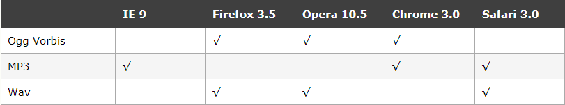
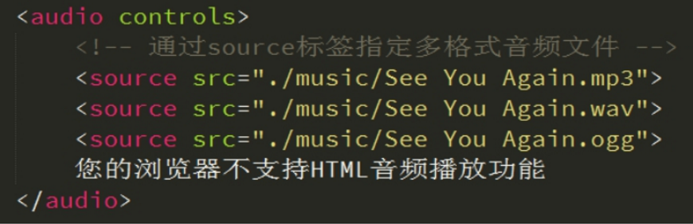
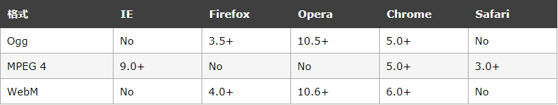
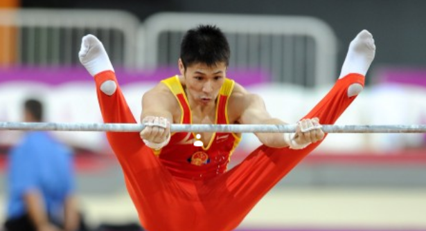

## 多媒体标签

- audio：播放音频
- video：播放视频

### 多媒体 audio

<http://www.w3school.com.cn/html5/html_5_audio.asp>

直到现在，仍然不存在一项旨在网页上播放音频的标准。

今天，大多数音频是通过插件（比如 Flash）来播放的。然而，并非所有浏览器都拥有同样的插件。

HTML5 规定了一种通过 audio 元素来包含音频的标准方法。

audio 元素能够播放声音文件或者音频流。

## 音频格式

由于版权等原因，不同的浏览器可支持播放的格式是不一样的，如下图供参考



使用相当简单，如下图所示

 

并且可以通过附加属性可以更友好控制音频的播放，如：

autoplay 自动播放

controls 是否显不默认播放控件

loop 循环播放   loop = 2 就是循环2次   loop  或者  loop = "-1"   无限循环 

多浏览器支持的方案，如下图

 


### 多媒体视频 video

直到现在，仍然不存在一项旨在网页上显示视频的标准。

今天，大多数视频是通过插件（比如 Flash）来显示的。然而，并非所有浏览器都拥有同样的插件。

HTML5 规定了一种通过 video 元素来包含视频的标准方法。

同音频播放一样，<video>使用也相当简单，如下图

 

同样，通过附加属性可以更友好的控制视频的播放

autoplay 自动播放

controls 是否显示默认播放控件

loop 循环播放

width 设置播放窗口宽度

height 设置播放窗口的高度

由于版权等原因，不同的浏览器可支持播放的格式是不一样的，如下图供参考



**多浏览器支持的方案，如下图******


## 《选择器涉及知识点》

<http://www.w3school.com.cn/cssref/css_selectors.asp>

《**关系、选择器**》

\> 表示父元素的直接子级元素

\+ 表示同级元素 紧挨着 的  下一个 元素

~ 表示同级元素的下面的所有元素

| 关系选择器 |                                    |                                               |
| ---------- | ---------------------------------- | --------------------------------------------- |
| >          | 子代选择器，只选择儿子             | li>p{color:red}                               |
| 空格       | 后代选择器，只要是后代都选择       | li p{color:red}---会选择器li里面的所有的p     |
| +          | 紧邻选择器，向下选择第一个邻居     | .one+li{color:red}--选择one下面的第一个邻居。 |
| ~          | 兄弟姐妹选择器，向下选择所有的兄弟 | .one~li{color:red}--选择one下面的所有li       |

**《属性选择器》**

| 属性选择器     |                          |                                            |
| -------------- | ------------------------ | ------------------------------------------ |
| 元素[属性]     | 选取带有某个属性的元素   | Li[qg]                                     |
| 元素[属性^=xx] | 选取以xx开头属性的元素   | Li[qg^=qiang]选取以qiang开头的属性为qg的li |
| 元素[属性$=xx] | 选取以xx结尾属性的元素   | Li[qg$=ge]选取以ge结尾的属性为qg的li       |
| 元素[属性*=xx] | 只要包含xx的属性就会选取 | Li[qg*=an]属性里面只要包含an就可以了       |

**伪类选择器（重要）**

| 伪类选择器    |                                      |                                                              |
| ------------- | ------------------------------------ | ------------------------------------------------------------ |
| :first-child  | 第一个符合的元素                     | Li:first-child{color:red;}                                   |
| :last-child   | 最后一个符合的元素                   | Li:last-child                                                |
| :only-child   | 唯一的一个孩子                       | li:only-child{background: pink;	}                         |
| :nth-child(n) | 我们的n从1                           | Li:nth-child(2){     background-color: red;} 就是选取第n个元素 |
| :empty        | 空的元素 空格也不行                  | <ul></ul>    ul:empty{}                                      |
| :not()        | 除了某个元素  等价于ps  ctrl+shift+i | li:not(.one){		background: pink;	}除了.one之外的第三个元素 |
| :before       | 在元素之前                           | Befoe和after必须有content                                    |
| :after        | 在元素之后                           | 生成是行内元素，如果想要放置盒子，定转换。div:before{		content: "今天"; 	}	div:after{		content:"星期五";	} |


## 盒子内减法

回顾：我们前面学习的css不管是给盒子加边框还是加内边距都是外加，都是往外面算，就是把你的盒子变大了。

box-sizing: border-box;/*盒子内减*/--这个就是往盒子里面算，以后再也不算边框多大没边距多大了。

## 2D转换transform

transform是CSS3中具有颠覆性的特征之一，可以实现元素的位移、旋转、倾斜、缩放，甚至支持矩阵方式，配合过渡和即将学习的动画知识，可以取代大量之前只能靠Flash才可以实现的效果。

变形转换 transform    transform  变换 变形的意思             《 transformers 变形金刚》

### 移动 translate(x, y)    

translate 移动平移的意思


```css
translate(50px,50px);
```

使用translate方法来将文字或图像在水平方向和垂直方向上分别垂直移动50像素。

可以改变元素的位置，x、y可为负值；

```
 translate(x,y)水平方向和垂直方向同时移动（也就是X轴和Y轴同时移动）
```

```css
div:first-child{
            width: 100px; height: 100px; background-color: red;
            transform:translate(100px,100px);/* 移动了盒子的位置，水平100垂直100 */
}
```

### 旋转 rotate(deg) 

可以对元素进行旋转，正值为顺时针，负值为逆时针；


```css
transform:rotate(45deg);
```

 注意单位是 deg 度数  

### 缩放 scale(x, y) 


```css
transform:scale(0.8,1);
```

可以对元素进行水平和垂直方向的缩放。该语句使用scale方法使该元素在水平方向上缩小了20%，垂直方向上不缩放。

```
scale(X,Y)使元素水平方向和垂直方向同时缩放（也就是X轴和Y轴同时缩放）
```

### 倾斜 skew(deg, deg) 


```css
transform:skew(30deg,0deg);
我们斜切skew(x,y)--用的单位是deg
注意：正数是往左推，负数是往右推。
```

## **浏览器前缀**


## 过渡(CSS3)

过渡（transition)具有颠覆性的特征之一，我们可以在不使用 Flash 动画或 JavaScript 的情况下，当元素从一种样式变换为另一种样式时为元素添加效果。

帧动画：通过一帧一帧的画面按照固定顺序和速度播放。如电影胶片


在CSS3里使用transition可以实现补间动画（过渡效果），并且当前元素只要有“属性”发生变化时即存在两种状态(我们用A和B代指），就可以实现平滑的过渡，为了方便演示采用hover切换两种状态，但是并不仅仅局限于hover状态来实现过渡。

语法格式:transition:属性名称 持续时间 运动方式 开始时间；

总结：我们的过渡transition不是动画，它是从一种形态渐渐的过渡到另外一种形态。

###  **属性名称**

   我们属性名称：就是你要对谁做过渡的效果。可以是宽度，可以是高度，可以是颜色，还可以是2D转换等等。

如果想要改变所有用----all（如果很多属性都想改变就用all）

### **持续时间**

我们持续时间的单位是s秒可以是小数   0.3s

持续时间：就是这个过渡的效果需要多长时间,多久。

###  **运动方式**

就是这个过渡的效果是以什么方式来改变的。运动方式如下图：


### **开始时间**

就是这个动画是什么时候开始，是立马开始能还是等1s开始。

如果立马开始 0s

如果想等1s在开始  就是1s

注意：这个过渡一般都是配合hover使用

​           过渡写在本身上（写在自己的身上）---谁要做动画就写在谁身上，不要写在hover身上。


```css
 div{ 
     width: 100px; 
     height: 100px; 
     background-color: pink; 
     transition:all 1s ease-in 0s;/* all所有属性 1s过度时间1s ease-in运动方式 0s立马开始; */}
div:hover{
     width: 200px;
     height: 200px;
}
```

### transform-origin可以调整元素转换变形的原点


```css
 div{transform-origin: left top;transform: rotate(45deg); }  /* 改变元素原点到左上角，然后进行顺时旋转45度 */    
```

 如果是4个角，可以用 left top这些，如果想要精确的位置， 可以用  px 像素。

```css
 div{transform-origin: 10px 10px;transform: rotate(45deg); }  /* 改变元素原点到x 为10  y 为10，然后进行顺时旋转45度 */ 
```


##  **Css3里面x轴和y轴旋转属性**

回顾：旋转rotate(角度)

第一、rotateX（角度）------沿着X轴旋转

第二、rotateY（角度）-----沿着Y轴旋转

### rotateX() 

 就是沿着 x 立体旋转.



```css
img {
  transition:all 0.5s ease 0s;
}
img:hove {

  transform:rotateX(180deg);
}
```

### rotateY()

沿着y轴进行旋转


```css
img {
  transition:all 0.5s ease 0s;
}
img:hove {

  transform:rotateX(180deg);
}
```

## 动画(CSS3) animation

动画是CSS3中具有颠覆性的特征之一，可通过设置多个节点来精确控制一个或一组动画，常用来实现复杂的动画效果。

语法格式：animation：动画名称 花费时间 运动方式 开始之前的延迟 播放次数 是否反方向;

   其中，动画名称和花费时间 是必选项。

### **动画名称**

就是给这个动画定义一个名字（可以任意起名字，必须是英文）；

### **花费时间**

这个动画执行完毕需要的时间  单位s秒  可以小数 0.3s--跟过渡一样

### **运动方式**

 

### **开始时间的延迟**

就是这个动画什么时候开始，如果立马开始就0s。如果1秒之后开始就1s

###  **播放次数**

如果想播放1次就写1---播放几次就写几，如果想一直播放infinite;

###  **是否反方向**

默认的不是反方向的，如果想反方向就写alternate;

这个关键帧配合着我们的css的动画效果

```css
@-webkit-keyframes  {----单值写法
    from{left：0；  }---从哪里来
    to {left:800px;  }--到哪里去
}
//下面是多组的写法
@-webkit-keyframes  {
 	0% { left：0；top：0； }
 	25% {left:600px;top:0;  }
	50% {left:600px;top:300px;  }
	75% {left:0px; top:300px;  }
	100% {left:0; top:0;  }

}
```

### 动画案例

```css
body{height:1500px;}
        .father{
            width: 300px;
            height: 300px;
            position: relative;
            margin: 100px auto;
        }
        .damao,.ermao{
            width: 300px;
            height: 300px;
            border: 1px solid blue;
            position:absolute;
            left:0;
            top:0;
            background: url(musict.jpg) no-repeat;
            border-radius: 50%;
        }
        .damao{ z-index: 1;}
        .damao{
            background:url(musicb.jpg) no-repeat;
            transform-origin: bottom;/*设置中心点*/
            transition: all 1s;/*过渡*/
        }

        .father:hover .damao{
            -webkit-transform: rotateX(180deg);
            -moz-transform: rotateX(180deg);
            -ms-transform: rotateX(180deg);
            -o-transform: rotateX(180deg);
            transform: rotateX(180deg);
        }
```
