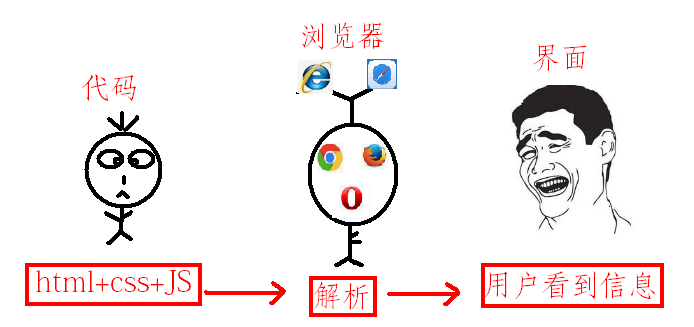
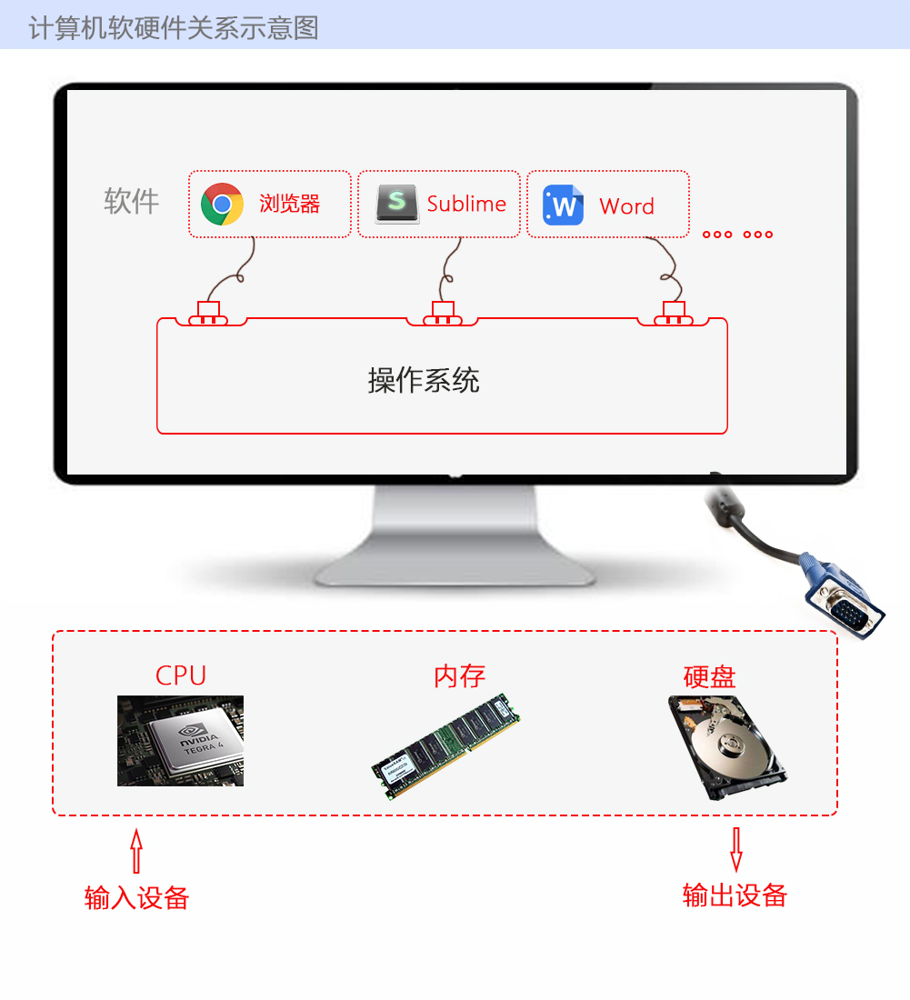

# JavaScript基础

##课前说明
目标：掌握编程的基本思想
掌握JavaScript的基础语法,使用常见API(备注)完成相应案例及练习和作业
培养独立解决问题能力
遇到问题先独立调试(牛X从规范和调试开始)
能够独立写出所有案例代码
注意：
1. 以大多数同学的接受能力为基准，稳准狠的前行
2. 注重基础，以最简单的案例说明问题，并以企业项目案例进行实践
3. 课上思考，课下提问。不需要深究的地方不要钻牛角尖。
4. 必须完成作业,基础坚挺的同学低调,基础薄弱同学多问
   一句话送给大家:**当你要放弃的时候想想当初为什么坚持到现在！**
   笔记和代码是”大家的”,
   自己写的才是自己的.

今日学习内容

- Web应用程序相关概念
- JavaScript概述
- JavaScript组成
- 第一个JavaScript程序
- 变量
- 数据类型
- 注释
- 运算符

今日学习目标

- 了解什么是JavaScript
- 了解JavaScript能做什么
- 记住JavaScript的组成
- **掌握第一个JavaScript程序开发**
- **掌握什么是变量以及变量的使用**
- 记住变量的命名规范
- **掌握五种基本数据类型的表示方式**
- 记住注释的两种用法
- **掌握基本数据类型的转换**
- **掌握运算符的使用**

##课外提示
1.敲代码用指法,指法配图，坚持一周者即可熟练
2.码农不需要练就一阳指或者二指禅
3.可以使用金山打字通，此处并非打广告,个人建议，天天敲代码，不停的反复的敲练习和作业，速度和基本功的快速提升
奉劝各位:
**保护好自己的手**
**控制自己的右手**

windows中的常用快捷键


##浏览器说明
浏览器是指可以显示网页服务器或者文件系统的HTML文件内容，并让用户与这些文件交互的一种软件。
通俗的讲:可以显示页面的一个软件,
国内网民计算机上常见的网页浏览器有，QQ浏览器、Internet Explorer、Firefox、Safari，Opera、Google Chrome、百度浏览器、搜狗浏览器、猎豹浏览器、360浏览器、UC浏览器、傲游浏览器、世界之窗浏览器等，浏览器是最经常使用到的客户端程序。
常用的五大浏览器：chrome，firefox，Safari，ie，opera
我们用chrome(谷歌浏览器)




## 网页、网站和应用程序

网页：单独的一个页面
网站：一些列相关的页面组成到一起
应用程序：可以和用户产生交互，并实现某种功能。

## 演示JavaScript的强大

大家可以打开以下几个网址，欣赏一下JavaScript的魅力！

http://www.jd.com
https://www.processon.com
http://www.17sucai.com
http://www.5icool.org
http://www.jsdaima.com
https://codecombat.com

### 什么是JavaScript（了解）

HTML （Hyper Text Markup Language）：超文本标记语言

CSS （Cascading Style Sheets）：层叠样式表，用来表现HTML文件样式的计算机语言

JavaScript：JavaScript是一种运行在浏览器，需要浏览器中的解析器解析之后才能运行的编程语言（脚本语言）

Netscape（网景）在最初将其脚本语言命名为LiveScript，后来Netscape在与Sun合作之后将其改名为JavaScript。JavaScript最初受Java启发而开始设计的，目的之一就是“看上去像Java”，因此语法上有类似之处，一些名称和命名规范也借自Java。JavaScript与Java名称上的近似，是当时Netscape为了营销考虑与Sun微系统达成协议的结果。Java和JavaScript的关系就像雷锋和雷峰塔的关系，周杰和周杰伦的关系，张雨和张雨生的关系，只是名字很像。

​	Java  服务器端的编程语言

​	JavaScript  运行在客户端(浏览器)的编程语言

> JavaScript是一种运行在***客户端*** 的***脚本语言*** 
> JavaScript的解释器被称为JavaScript引擎，为浏览器的一部分，广泛用于客户端的脚本语言，最早是在HTML（标准通用标记语言下的一个应用）网页上使用，用来给HTML网页增加动态功能。


### JavaScript现在的意义(应用场景)

JavaScript 发展到现在几乎无所不能。

1. 网页特效

2. 服务端开发(Node.js)

3. 命令行工具(Node.js)

4. 桌面程序(Electron)

5. App(Cordova)

6. 控制硬件-物联网(Ruff)

7. 游戏开发(cocos2d-js)

   

   ### JavaScript最初的应用场景（了解）

   JavaScript最初是应用于表单验证的，如下：

   

   ```javascript
   	在最初的web应用中，由于网络速度较慢，当用在浏览器点击某个功能后（此时正在连接到服务器），浏览器页面可能会卡在加载数据的状态，甚至会整个页面卡死，直到数据完全显示了之后，用户才能继续操作。
   
   	在这种网络环境下，如果去注册一个账号，此时手机号码（必填）忘记填写了，当点击注册按钮之后，浏览器会卡死几十秒，在这几十秒里面，用户根本不知道自己填写的注册信息是否合法，只等待浏览器加载完毕后，页面上才会提醒用户 “手机号码不能为空”，几十秒时间里，用户等来的是一个 “手机号码不能为空” 的 注册失败提示。这种情况下用户体验非常差。
   
   	为了解决这个问题，网景公司提出设想，可不可以利用某种技术，在浏览器连接服务器之前，先检查用户填写的数据是否合法，如果不合法就不连接服务器且提示用户那个数据不合法。在这种情况下，JavaScript（当时叫LiveScript）应运而生。JavaScript最初的应用就是用在浏览器端验证用户提交的数据的。
   ```

   

### JavaScript和HTML、CSS的区别

1. HTML：提供网页的结构，提供网页中的内容
2. CSS: 用来美化网页
3. JavaScript: 可以用来控制网页内容，给网页增加动态的效果

### JavaScript的组成

JavaScript由三个部分组成，分别是 ECMAScript、DOM、BOM。**（记住这个图）**


​									**图1-1 JavaScript的组成**


### ECMAScript - JavaScript的核心 

ECMA 欧洲计算机制造联合会

网景：JavaScript

微软：JScript

定义了JavaScript的语法规范  

JavaScript的核心，描述了语言的基本语法和数据类型，ECMAScript是一套标准，定义了一种语言的标准与具体实现无关

#### DOM(学到以后再看)

DOM(Document Object Model)即文档对象模型，一套操作页面元素的API；

DOM把HTML页面当做倒状树结构的文档，把树的分支点看做节点，通过DOM提供的API可以对树上的节点进行操作；


​									**图 1-3 DOM节点结构示意图**


#### BOM(学到以后再看)

BOM(Browser Object Model)即浏览器对象模型，一套操作浏览器功能的API；

通过BOM可以操作浏览器，是浏览器执行某些功能，比如：控制浏览器跳转、计时器、获取屏幕的宽度、高度等等；

```javascript
API（Application Programming Interface）：应用程序接口，是一组具有特定功能的命令的集合。
```

## JavaScript初体验

CSS：行内样式、嵌入样式、外部样式

### JavaScript的书写位置 

JS书写位置与CSS的书写位置相似，JavaScript也有三种书写位置；

- 写在行内

```html
<input type="button" value="按钮" onclick="alert('Hello World')" />
```

- 写在script标签中

```html
<head>
  <script>
    alert('Hello World!');
  </script>
</head>
```

- 写在外部js文件中，在页面引入

```html
<script src="main.js"></script>
```

- 注意点

  1、script标签不能写成单标签：
  	在外联式引用js文件时，script标签中不可以写JavaScript代码，并且script标签不能写成单标签，即不能写成<script src="index.js"/>
  2、省略type属性：
      在以前的代码中，<script>标签中会使用 type="text/javascript"。现在可不写这个代码了，因为JavaScript 是	   所有现代浏览器以及 HTML5 中的默认脚本语言。
  3、加载顺序：
  	作为HTML文档内容的一部分，JavaScript默认遵循HTML文档的加载顺序，即自上而下的加载顺序

## 计算机组成

### 软件

- 应用软件：浏览器(Chrome/IE/Firefox)、QQ、Sublime、Word
- 系统软件：Windows、Linux、mac OSX

### 硬件

- 三大件：CPU、内存、硬盘    -- 主板
- 输入设备：鼠标、键盘、手写板、摄像头等
- 输出设备：显示器、打印机、投影仪等




## 变量

### 什么是变量

- 什么是变量：变量就是随时随地会发生变化的量。

  变量是计算机内存中存储数据的标识符，根据变量名称可以获取到内存中存储的数据

- 为什么要使用变量

  目的：使用变量可以方便地存储、获取、修改、删除内存中的数据。
  
  ​	数据在计算机中的存储存储过程跟客人在酒店开房的过程相似，客人在酒店开房后，会拿到一个房间号，当客人退房后，房间空出来，等待下一个客人入住，也就是说，一个房间在不同的时间可能住着不同的客人。计算机中内存好比房间，变量好比房间号码，房间中的客人好比内存中的数据。根据房间号码就找到住在房间里的客人。同理，根据变量的名称就能找到存在内存中的那个数据。
  
  
  
  

### 如何使用变量

- var声明变量

```javascript
var age;
```

- 变量的赋值

```javascript
var age;
age = 18;
```

- 同时声明多个变量

```javascript
var age, name, sex;
age = 10;
name = 'zs';
```

- 同时声明多个变量并赋值


```javascript
var age = 10, name = 'zs';
```

### 变量在内存中的存储

```javascript
var age = 18;
var name = "张三"
```


### 变量的命名规则和规范

- 规则 - 必须遵守的，不遵守会报错

  - 由字母、数字、下划线、$符号组成，不能以数字开头
- 不能是关键字和保留字，例如：for、while。
  
  - 区分大小写
- **记忆技巧：**由以 **字母** 或 **$** 或 **_** 开头的 **非关键字** 。
  
- 规范 - 建议遵守的，不遵守会报错

  - 变量名必须有意义、可顾名思义，例如age、name；
  - 遵守驼峰命名法：第一个单词首字母小写，后面单词的首字母需要大写。例如：userName、userPassword；
  - 

- 下面哪些变量名不合法

  ```
  a	    
  1
  age18
  18age
  name
  $name
  _sex
  theworld  
  theWorld
  ```

### 案例

1. 交换两个变量的值的第一个思路：使用第三方的变量进行交换

   ```
   /*
       需求1：使用临时变量作为辅助，交换两个变量的值
       需求分析：
          1、定义三个变量，两个用于存储数据，一个作为临时变量。如 num1, num2, temp ;
          2、使用临时变量辅助，先完成一个变量值的交换。如 temp = num1, num1 = num2 ;
          3、最后完成另一个变量值的交换
    */
   var num1 = 10;
   var num2 = 20;
   //把num1 这个变量的值取出来放在temp变量中
   var temp = num1;
   //把num2这个变量的值取出来放在num1变量中
   num1 = num2;
   //把temp变量的值取出来放在num2变量中
   num2 = temp;
   console.log(num1); //20
   console.log(num2); //10
   ```

2. 不使用临时变量，交换两个数值变量的值 （第二种方式交换:一般适用于数字的交换）(了解)

   ```
   /*这种方式了解即可
   需求分析：
         1、两个变量的交换公式，如 a, b
           a = a + b;
           b = a - b;
           a = a - b;
   */        
   var num1 = 10;
   var num2 = 20;
   //把num1的变量中的值和num2变量中的值，取出来相加，重新赋值给num1这个变量
    num1 = num1 + num2; //30
    //num1变量的值和num2变量的值取出来，相减的结果重新赋值给num2
    num2 = num1 - num2;//10
    //num1变量的值和num2变量的值取出来，相减的结果重新赋值给num1
    num1 = num1 - num2;//20
    console.log(num1, num2);//20 10
   ```

## 注释（解释代码的）

### 单行注释

用来描述下面一个或多行代码的作用

```javascript
// 这是一个变量
var name = 'hm';
```

### 多行注释

用来注释多条代码

```javascript
/*
var age = 18;
var name = 'zs';
console.log(name, age);
*/
```

## 数据类型

物以类聚，人以群分，这是对现实事物的分类，编程语言中的数据也是按类型来区分的。编程中的将数据区分成不同的类型，在代码中用不同的方式表示，就是所谓的数据类型。比如，250，123 是 数值（数字）类型，'叩丁狼'，'我爱学习' 是 字符串类型。在JavaScript中将数据的值划分成了不同的类型，按照不同的存储方式可以分为**基本数据类型**和**引用数据类型**两种，本节课先学习基本数据类型。

### 基本数据类型

在JavaScript语言中，规定了五大基本数据类型，它们分别是：
	一、Number：数值类型
	二、String：字符串类型
	三、Boolean：布尔类型
	四、Undefined：未定义类型
	五、Null：空类型

**（记住JavaScript的五大基本数据类型）**

### 获取变量的类型（掌握）

使用typeof本身是一个关键字，使用时应注意：

```
typeof 的使用语法
* 1、typeof 变量名
* 2、typeof (变量名)
```

简单类型（基本类型）：String（字符串）、Number（数值）、Boolean（布尔）、Undefined（未定义）、Null（空）

```javascript
//如何判断一个变量的数据类型？
// typeof 变量名/值
console.log(typeof 123);//number
console.log(typeof '123');//string
console.log(typeof true);//boolean
console.log(typeof undefined);//undefined
console.log(typeof null);//object,对象
```

#### Number类型

- Number类型也叫 数值类型 。

  **表示方式（掌握）**

  ```javascript
  字面量：
  	也叫常量、直接量，如下 110 1024  60.5  520
  变量：
  	具有一个变量名，如 var age = 18; 中的 age 变量
  ```

  **字面量（熟悉）**

  ```javascript
  字面量也叫常量、直接量，是指代码中直接给出的一个量，表示一个固定的值。如下
  数值字面量：8, 9, 10
  字符串字面量：'叩丁狼', "全栈工程师"
  布尔字面量：true，false
  ```

  

- 进制

```
十进制
	var num = 9;
	进行算数计算时，八进制和十六进制表示的数值最终都将被转换成十进制数值。
十六进制
	var num = 0xA;
	数字序列范围：0~9以及A~F
八进制
    var num1 = 07;   // 对应十进制的7
    数字序列范围：0~7
    如果字面值中的数值超出了范围，那么前导零将被忽略，后面的数值将被当作十进制数值解析
```

- 浮点数注意问题：var result = 0.1 + 0.2;    // 结果不是 0.3，而是：0.30000000000000004


- 数值范围

```
最小值：Number.MIN_VALUE，这个值为： 5e-324
最大值：Number.MAX_VALUE，这个值为： 1.7976931348623157e+308
```

- 数值判断

  - NaN：not a number
    - NaN 与任何值都不相等，包括他本身
  - isNaN: is not a number是不是不是一个数字（判断是否是一个数字；如果是数字是false，如果不是数字就是true）

#### String类型

字符串表示“串在一起”的字符，在代码中使用英文字符的引号 ( 单引号 / 双引号 ) 引起来的内容就是字符串的内容。比如：

1、字面量：
	'程序猿'，'金刚狼', "叩丁狼"
2、变量：
	var str = '叩丁狼'; 中的str 变量
注意：字符串可以用单引号表示，也可以用双引号表示。但在实际开发中，为了避免与html中的双引号发生冲突，JS中推荐使用单引号。

3、思考：如何打印以下字符串。
	我还想再活"五百年"
	我在"叩丁狼'挖矿'"

**转义符（掌握 ）**

要求掌握转义符	\\'	\\"	\t	\n	四个的用法。

在JavaScript中，有些字符除了本身表示的意义，还默认作为具有特殊含义的符号来使用，如果想使用字符本身的意义，则需要用转义符进行转义。

常用转义符字符及其意义如下

- 

- **字符串长度（掌握）**

  使用length属性获取字符串的长度

- ```javascript
// str.length中的 . 可以看做“的”的意思，表示 调用； length 是长度的意思, 此操作得到一个数值，表示字符串中字符的个数，即字符串的长度。
  var str = 'Hello 叩丁狼';
console.log(str.length);
  ```
  
- 字符串拼接、字符串拼接使用 + 连接

  ```javascript
var str1 = "你好";
  var str2 = "我好";
  console.log(str1 + str2);
  var num11 = 10;
  var num22 = 20;
  console.log(num11 + num22);
  //只要有一个是字符串的，其他的是数字，也是拼接，不是相加
  var num1 ="250";
var num2 =250;
  console.log(num1 + num2);
  ```
  
  1. 两边只要有一个是字符串，那么+就是字符串拼接功能
  2. 两边如果都是数字，那么就是算术运算。
  3. 总结：字符相连，数值相加；

- #### Boolean类型

  **表示方式（掌握）**

  ```javascript
  字面量：  
  	只有 true 和 false 两种值，区分大小写
  变量：
  	var bool = true; 中的 bool 变量
  ```

  计算机内部存储：true为1，false为0

  ```javascript
  // Boolean：布尔类型，只有两种值 true false
  var gender = false;
  console.log(gender);
  ```

#### Undefined和Null

**表示方式（掌握）**

1、Undefined类型只有一个值undefined。声明了但未赋值的变量，默认值为undefined，表示没有被赋值。

2、Null类型只有一个值null。表示一个空，如果变量值想为null，必须手动赋值为null。

```javascript
//Undefined：只用一个值 undefined，声明一个变量后，不复制，默认值就是undefined
var age;
console.log(age);//undefined

//Null：只有一个值 null，JavaScript中只有给变量赋值为null时，变量才为null，否则永远不为null
var name = null;
console.log(name);//null
```

## 数据类型转换

如何使用谷歌浏览器，快速的查看数据类型？

通过观察可发现：浏览器控制台输出的字符串的颜色是黑色的，数值类型是蓝色的，布尔类型也是蓝色的，undefined和null是灰色的。**（记住以下几种颜色所表示的数据类型）**

```javascript
console.log('wolfcode');
console.log(123);
console.log(true);
console.log(undefined);
console.log(null);
```

### 转换成数值类型

其他类型转成数值类型的时候，存在有两种可能的值，一种是数字，一种是NaN（NaN也是Number类型！）。转换成功时，结果为数字，转成失败时，结果为NaN。

**parseInt()函数（掌握）**

如果第一个字符是数字或运算符号，那么就开始解析，直到遇到非数字字符，停止解析并得到解析结果；
如果第一个字符是非数字且非运算符号，则不解析并得到结果 NaN。

```javascript
//使用parseInt()函数
console.log(parseInt("10"));//10
console.log(parseInt("10abcdefg"));//10
console.log(parseInt("g10"));//NaN
console.log(parseInt("1fds0"));//1
console.log(parseInt("10.98"));//10
console.log(parseInt("10.98abcdefg"));//10
```

**parseFloat()函数（掌握）**

parseFloat()把其他类型转换成浮点数。
parseFloat()和parseInt非常相似，不同之处在于：
	1、parseFloat会解析第一个小数点，遇到第二个小数点或者非数字字符时停止解析，并得到结果。

```javascript
console.log(parseFloat("10"));//10
console.log(parseFloat("10abcdefg"));//10
console.log(parseFloat("g10"));//NaN
console.log(parseFloat("1fds0"));//1
console.log(parseFloat("10.98.98"));//10.98
console.log(parseFloat("10.98abcdefg"));//10.98
```

**Number()函数（了解）**

Number()可以把任意值转换成数值类型，在转换字符串的时候，如果字符串中存在一个非数字字符，转换结果为 NaN。

```javascript
//Number()可以把任意值转换成数值类型，如果要转换的字符串中有一个不是数值的字符，转换结果为 NaN
console.log(Number("10"));//10
console.log(Number("10abcdefg"));//NaN
console.log(Number("g10"));//NaN
console.log(Number("1fds0"));//NaN
console.log(Number("10.98"));//10.98
console.log(Number("10.98abcdefg"));//NaN
```

+，-0 运算（了解）**

我们还可以使用 + 号 和 - 号将其他类型转换成数值类型。

```javascript
var strNum = '18';
console.log(+strNum);		// 取正
console.log(-strNum);		// 取负
console.log(strNum - 0);     // strNum先被转换成数值类型，再做减法运算
console.log(strNum + 0);     // 0先被转换成字符串类型，再做拼接
```

**注意**

```javascript
加号和减号放在变量前，分别是取正、取负的效果；
变量减去0，默认先将变量转换成数值类型，再做减法运算，变量加上0，则按照字符串拼接的规则运算；
```

- ### 转换成字符串类型

  **toString()方法（掌握）**
  
  ```javascript
  //方式一：toString()
  var age = 18;
  console.log(age.toString());
  console.log(true.toString());
  // console.log(undefined.toString());//Cannot read property 'toString' of undefined
  
  ```
  
  **String()函数（了解）**
  
  ```javascript
  //有了toString()函数，为什么还要有String()函数？
  //某些类型没有toString()函数，这个时候可以使用String()。例如：undefined和null，可以写成String(undefined)和String(null)。
  
  //方式二：String()
  console.log(String(undefined));
  console.log(String(null));
  ```
  
  **注意**
  
  ```javascript
  1、toString()方法只能将数值类型和布尔类型转换成字符串类型，不能将Undefined和Null类型转成字符串类型；
  2、String()函数能将所有基本类型转成字符串类型；
  3、函数和方法的区别：方法需要调用者才能调用，函数不需要调用者；
  ```
  
  **拼接字符串（掌握）**
  
  ```javascript
  console.log(123 + '');
  console.log(true + '');
  console.log(undefined + '');
  console.log(null + '');
  ```
  
  num  +  "" 的形式，当 "+" 号一边的操作符是字符串类型，另一边的操作符是其它类型的时候，会先把其它类型转换成字符串再进行字符串拼接，最后返回字符串。
  
  小结：以上三种数据类型转换，以后开发中会常用到toString方式。

### 转换成布尔类型

Boolean()函数

转换成false的五种特殊值：""（空字符串）、0（包括 0、-0）、undefined、null、NaN；

如果某个值为 ""（空字符串）、0（包括 0、-0）、undefined、null、NaN时，那么这个值转换成布尔类型之后的值为 false。否则，其值为 true。**（记住五种特殊值）**

```javascript
//Boolean()函数
console.log(Boolean('')); 
console.log(Boolean(0)); 
console.log(Boolean(undefined)); 
console.log(Boolean(null)); 
console.log(Boolean(NaN)); 
```

**小结**

```javascript
在JavaScript中，类型转换不会报错，转成String时，Undefined和Null没有toString()方法；转成Number时，结果为数值或NaN；转成Boolean时，有五中特殊情况
```

## 运算符（掌握）

运算符又叫操作符（ operator ），编程中常见的运算符包括 算术运算符，一元运算符，逻辑运算符，关系运算符，赋值运算符等。由算数运算符连接起来的表达式叫做**算术运算表达式**。

要学习运算符就必须知道表达式是什么以及表达式的作用，以下是表达式的写法，如 !true , 3 - 2，6==11

**表达式**

```javascript
组成：表达式是由操作符和操作数组成。
	如 !true , 3 - 2，6==11
特点：表达式执行结束之后会返回（得到）一个结果；
	如 !true -> false, 8-3 -> 5，6==11 -> false
```

### 算术运算符（数学运算符）

常用的算术运算符有 +   -   *   /   %（取余） ，如 3%2 = 1 

```javascript
//+ - * / %（取余） 3%2=1 
var x = 10;
var y = 5;
console.log(x + y);//15
console.log(x - y);//5
console.log(x * y);//50
console.log(x / y);//2
console.log(10 % 3);//1
```

### 一元运算符

只有一个操作数的运算符叫一元运算符，如 ++8 中的 ++ 运算符。
常用的一元运算符有 ++、-- 和 ！，由于 ！ 是做逻辑运算的，我们又把它归类为逻辑运算符。下面我们先来学习 ++ 和 -- ，++ 又分为 前置++ 和 后置++，-- 又分为 前置-- 和 后置--。我们这节课只学习前置++和后置++，大家可以通过举一反三的思想来学习前置--和后置-- 。

在做一元运算符操作的时候，表达式的作用体现得非常重要。在 ++ 和 -- 运算中，不管是前置还是后置，表达式的执行过程都只有两个步骤，分别是 **执行运算** 和 **返回表达式的结果**。具体操作如下

**前置++**
表达式的执行过程如下
	步骤一：执行操作数的++运算（自身加1）
	步骤二：操作数作为表达式的结果返回

```javascript
//前置++
var num1 = 8;
++num1;//自身加1
console.log(num1);

var num2 = 6;
console.log(++num2);
console.log(num1 + ++num2);
```

**后置++**
表达式的执行过程如下
	步骤一：操作数作为表达式的结果返回
	步骤二：执行操作数的++运算（自身加1）

```javascript
//后置++
var num1 = 5;
num1++;//自身加1
console.log(num1);

var num2 = 6;
console.log(num1 + num2++);
```

课堂练习

```javascript
var a = 1; var b = ++a + ++a; console.log(b);    
var a = 1; var b = a++ + ++a; console.log(b);    
var a = 1; var b = a++ + a++; console.log(b);    
var a = 1; var b = ++a + a++; console.log(b);  
```

**小结**

```javascript
前置++/--
表达式的执行过程如下
	步骤一：执行操作数的 ++/-- 运算（自身加1）
	步骤二：操作数作为表达式的结果返回

后置++/--
表达式的执行过程如下
	步骤一：操作数作为表达式的结果返回
	步骤二：执行操作数的 ++/-- 运算（自身加1）
	
```

**总结**
**前置++：先加1，后参与运算**
**后置++：先参与运算，后加1**
**上面两个理解后，下面两个自通**
**前置--  ：先减1，后参与运算**
**后置--  ：先参与运算，后减1**

### 逻辑运算符(布尔运算符)

逻辑运算符（布尔运算符）是针对布尔类型的值进行运算的，JS中的逻辑运算符有以下三种。

逻辑与（&& ），若两个操作数同时为true，则表达式的运算结果为true，否则运算结果为false；
逻辑或（||），若两个操作数中有一个为true，则表达式的运算结果为true，否则运算为false；
逻辑非（!），取反；
注意：逻辑运算符的表达式返回的结果总是 布尔类型，即 true 或 false

```javascript
console.log(!true);
console.log(!false);
console.log(true&&true);
console.log(true&&false);
console.log(false&&true);
console.log(false&&false);
console.log(true||true);
console.log(false||true);
console.log(true||false);
console.log(false||false);
```


### 关系运算符(比较运算符)

关系运算符 是用于比较两个操作数的大小或相等的，关系运算符的表达式返回的结果是布尔类型，即 true 或 false。

小于： <  
大于： >  
大于等于： >=  
小于等于： <= 
等于： == 
不等于： != 
全等于： === 
全不等于： !==

### 关系运算符(比较运算符)
	<  >  >=  <= == != === !==
```javascript
==与===的区别：==只进行值得比较，===类型和值同时相等，则相等
console.log(3>5);/*控制台返回假false*/
console.log(3>=3);/*控制台返回真true*/
console.log(3<5);/*控制台返回真true*/
console.log(2==2);/*控制台返回真true*/
console.log(2=='2');/*控制台返回真true,隐士类型转换了，做好事不留名*/
console.log(2==='2');/*控制台返回假false、全等不转换了*/
console.log(3-'2');/*控制台返回1,它也是隐士类型转换了，做好事不留名*/
console.log(3!=4);/*控制台返回真true*/
console.log(1==true);/*控制台返回真true*/
console.log(2==true); /*控制台返回假false*/
console.log(0==false); /*控制台返回真true*/
```
